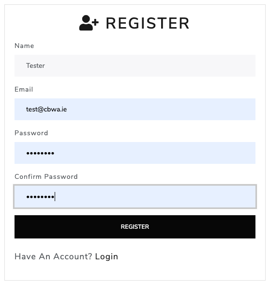
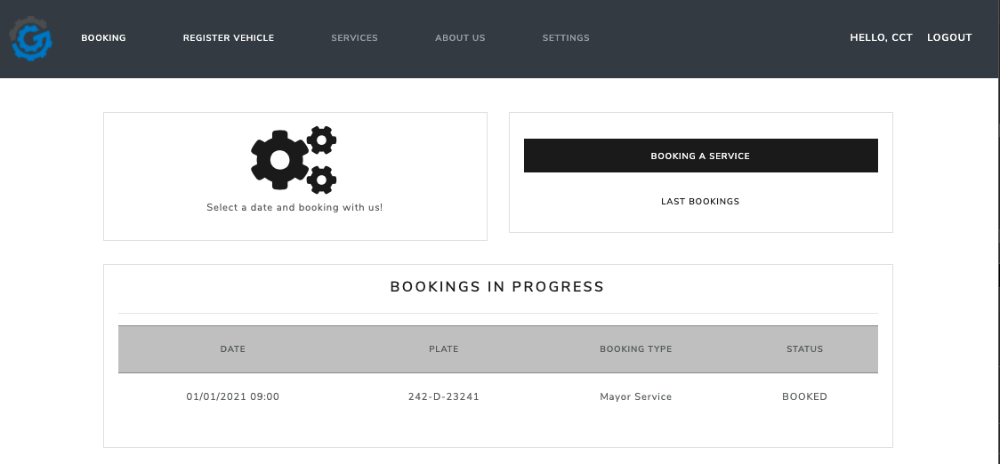

# GER'S GARAGE

> This is a web application project that helps to customers to make bookings in a system.

## Table of contents

- [General info](#general-info)
- [Screenshots](#screenshots)
- [Technologies](#technologies)
- [Setup](#setup)
- [Changelog](#changelog)
- [Roadmap](#roadmap)
- [Contact](#contact)

## General info

> Through this application, the user can register a project and the bugs or issues founded in such project. Within every issue founded, the user can add follow up comments about the issue. It is also possible to add more users, all password's users are hashed for security reasons.

## Screenshots

## Technologies

- Python - version 3.9.1
- Django - version 1.19
- Postgresql - version 12.5
- Nodemailer - version 6.4

## Setup

Access the app through the following link:

- https://gersgarage-2020085.herokuapp.com//

## Changelog

- December 2020 Created project - _finished_
- January 2021 Frontend - Loggin/Register - _finished_

## Roadmap

- February 2021 Docker-ise application
- March 2021 Unit Testing

## Contact

Created by [@claugf](mailto:claudiagf_7@hotmail.com) - feel free to contact me!
