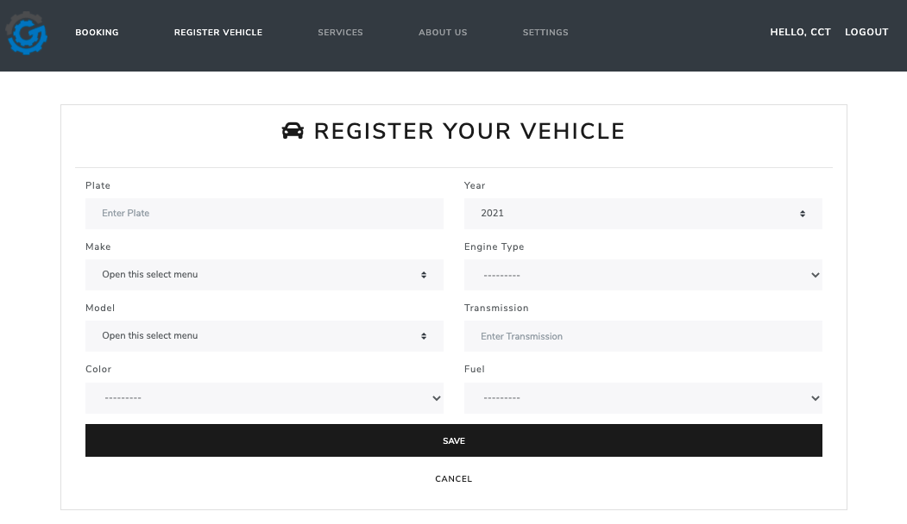

# GER'S GARAGE

> This is a web application project that helps to customers to make bookings in a system.

## Table of contents

- [General info](#general-info)
- [Screenshots](#screenshots)
- [Technologies](#technologies)
- [Access](#access)
- [Changelog](#changelog)
- [Roadmap](#roadmap)
- [Contact](#contact)

## General info

> This web application provides a clear, clean and reliable booking process, where the customer can get the earlier available date for their mechanical services, manage and check their bookings through their private accounts. On the other hand, this web application will help to organize the bookings efficiently, saving Ger’s time.

## Screenshots

## Technologies

- Python - version 3.9.1
- Django - version 3.1.5
- Postgresql - version 13
- PgAdmin - version 4
- Psycopg - version 2.8.6
- Nodemailer - version 6.4

## Access

Access the app through the following link:

- https://gersgarage-2020085.herokuapp.com//

## Changelog

- December 2020 Set enviroment - _finished_
- January 2021 Register/Loggin - _finished_
- January 2021 Register Vehicle - _finished_
- January 2021 Book a service - _finished_

## Roadmap

- February 2021 Dashboard Admin
- February 2021 Setting Page
- February 2021 Sent email confirmation
- March 2021 Unit Testing

## Contact

Created by [@claugf](mailto:claudiagf_7@hotmail.com) - feel free to contact me!
